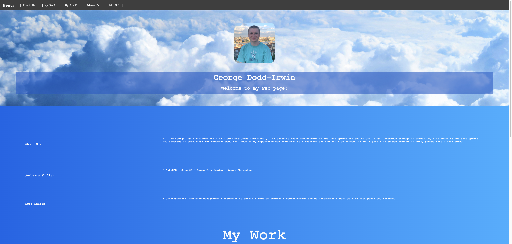
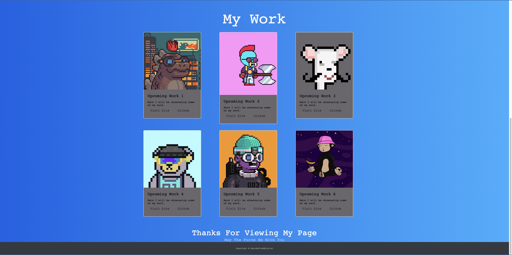

# Welcome to my portfolio page

## Description: 

My objecctive was to make a portfolio page to aid my web dev career. 

How have I done this? I have built a web page to load my work ads well as link to several of my personal information pages. 

## Installation
N/A

## Usage
The website consists of a single page broken down in to an interactive header linking to a main section, work grid and a footer.

The main section will show a collection of my work, for now its showing my digital art portfolio. 

Finaly there is the footer with a little message. 

## License
Please refer to the LICENSE in the repo.

